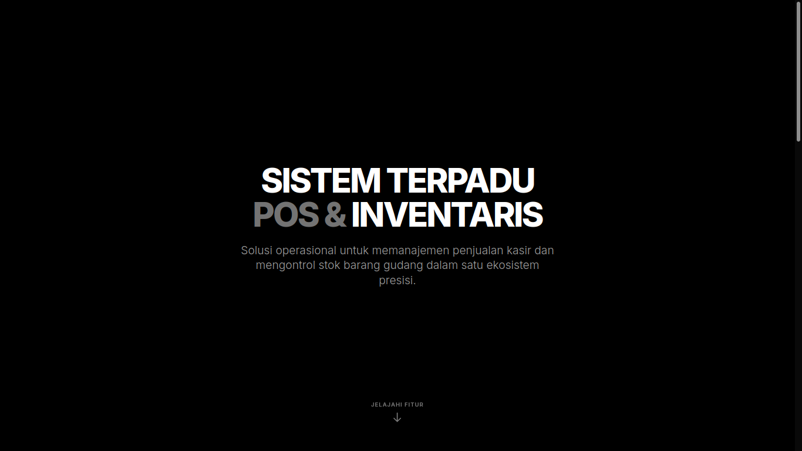
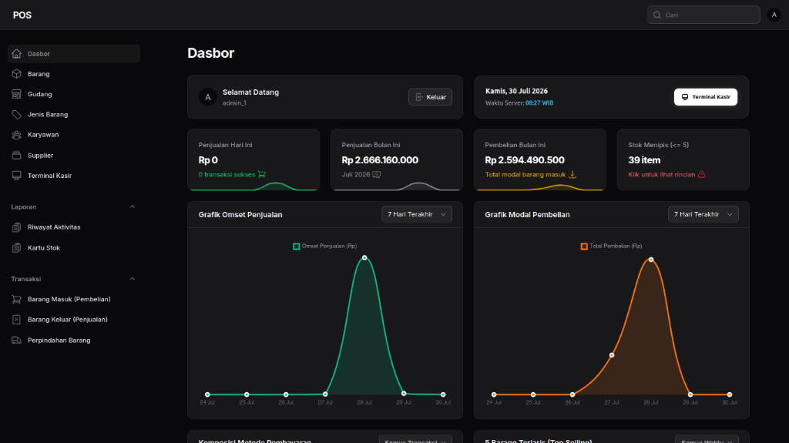
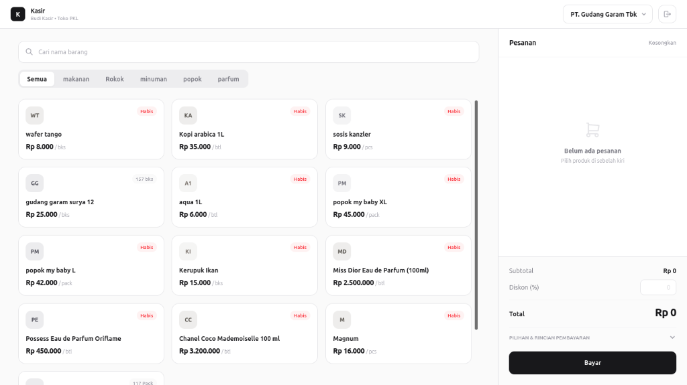
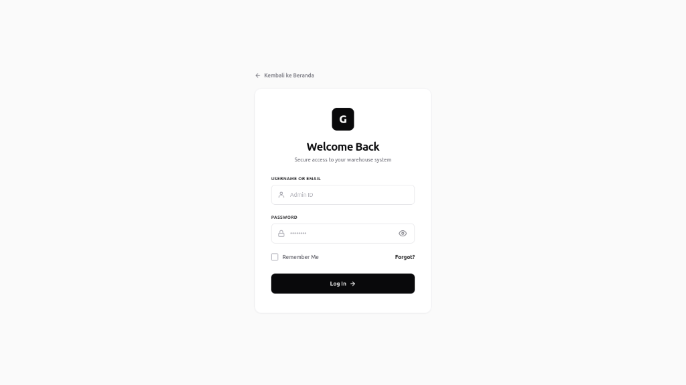

# Point of Sale (POS) System

A modern, web-based Point of Sale (POS) system designed for retail and distribution management. Built using **Laravel 13**, **Filament**, and **PostgreSQL**.



---

## Table of Contents

- [Screenshots](#screenshots)
- [Key Features](#key-features)
- [Tech Stack](#tech-stack)
- [System Architecture & Directory Structure](#system-architecture--directory-structure)
- [Installation & Setup](#installation--setup)
- [Configuration](#configuration)
- [Usage & Workflows](#usage--workflows)
- [Database Schema](#database-schema)
- [License](#license)

---

## Screenshots

### 1. Landing Page


### 2. Admin Dashboard (`/admin`)


### 3. Cashier POS Interface (`/kasir`)


### 4. Authentication & Login
| Admin System Login | Cashier Terminal Login |
|:---:|:---:|
|  |  |

---

## Key Features

### Cashier Interface (`/kasir`)


- **Fully Responsive Layout**: Works seamlessly on desktop, tablet, and mobile screens with a dedicated slide-over drawer for mobile shopping cart navigation.
- **Real-Time Product Search & Filtering**: Instant search by item name and category filtering.
- **Strict Input Validation**:
  - Discount percentages are strictly clamped between 0% and 100%.
  - Non-numeric input and negative values are automatically stripped.
- **Thousands Separator Formatting**: Cash received input (`input-bayar`) automatically formats digits with Indonesian thousands separators (e.g., `1.000.000`).
- **Payment Method Support**: Handles Cash (Tunai), QRIS, and Bank Transfer.
- **Automated Calculations**: Instant calculation of subtotal, transaction discount, net total, and change due.
- **Receipt Generation**: Virtual receipt preview with thermal print capabilities.

### Admin Dashboard (`/admin`)


- **Overview Statistics Cards**:
  - Today's Sales
  - This Month's Sales
  - This Month's Purchases
  - Low Stock Alert Count
- **Analytical Charts**:
  - Sales Revenue Chart (7-day line chart)
  - Purchase Expenditure Chart (7-day line chart)
- **Low Stock Notification**: Automatic alert trigger for items with stock <= 5 units.

### Data Management (CRUD)
- **Products (Barang)**: Product master data, selling price, unit, category, and warehouse stock association.
- **Categories (Jenis Barang)**: Product classification and groupings.
- **Warehouses (Gudang)**: Storage locations for inventory tracking.
- **Suppliers**: Vendor and supplier records.
- **Customers**: Customer directory for member/recurring transactions.

### Reports & Inventory Tracking
- **Sales History (Barang Keluar)**: Transaction records linked to cashier users (`user_id`). Features a row-click modal view.
- **Purchase History (Barang Masuk)**: Vendor purchase records with stock increment logic and modal inspection.
- **Stock Transfers (Perpindahan Barang)**: Inter-warehouse inventory transfers with modal inspection.
- **Stock Ledger (Kartu Stok)**: Full audit trail of all stock movements (incoming, outgoing, transfer).
- **Activity Log**: User activity tracking via Spatie Laravel Activitylog.

### Architecture Highlights
- Configured for **WIB (Asia/Jakarta)** timezone across all components.
- Single Page Application (SPA) navigation mode enabled for Filament Admin Panel.
- Automated inventory validation and stock rollback handling.

---

## Tech Stack

| Layer | Technology |
|---|---|
| **Backend Framework** | PHP 8.3+, Laravel 13 |
| **Admin Panel** | Filament |
| **Cashier Interface** | Vanilla JavaScript (ES6+), Tailwind CSS, Vite |
| **Database** | PostgreSQL |
| **Audit Logging** | Spatie Laravel Activitylog |
| **Alert Systems** | SweetAlert2 |

---

## System Architecture & Directory Structure

```
app/
├── Filament/
│   ├── Resources/
│   │   ├── Activities/          # Activity log history
│   │   ├── Barangs/             # Product master management
│   │   ├── Customers/           # Customer management
│   │   ├── Gudangs/             # Warehouse management
│   │   ├── JenisBarangs/        # Product category management
│   │   ├── KartuStoks/          # Read-only stock ledger
│   │   ├── Pembelians/          # Purchase orders (incoming goods)
│   │   ├── Penjualans/          # Sales records (outgoing goods)
│   │   ├── PerpindahanBarangs/  # Inter-warehouse transfers
│   │   └── Suppliers/           # Supplier management
│   └── Widgets/
│       ├── StatsOverviewWidget.php      # Dashboard stat cards
│       ├── PenjualanChartWidget.php     # Sales trend chart
│       └── PembelianChartWidget.php     # Purchase cost chart
├── Http/Controllers/
│   └── KasirController.php     # Cashier page endpoints & processing
├── Models/                      # Eloquent ORM Models
├── Services/
│   └── StokService.php         # Inventory logic, ledger recording, rollback
└── Providers/
    └── Filament/
        └── AdminPanelProvider.php  # Admin panel configuration
```

---

## Installation & Setup

### Prerequisites
- PHP 8.3+
- Composer
- Node.js (v18+) & NPM
- PostgreSQL

### Installation Steps

```bash
# 1. Clone the repository
git clone <repository-url>
cd POS-PKL

# 2. Install PHP dependencies
composer install

# 3. Install JavaScript dependencies
npm install

# 4. Environment setup
cp .env.example .env

# 5. Generate application key
php artisan key:generate

# 6. Configure database parameters in .env

# 7. Run database migrations
php artisan migrate

# 8. Build production assets
npm run build

# 9. Start local development server
php artisan serve
```

---

## Configuration

### Environment Variables (`.env`)

```env
APP_NAME=POS-PKL
APP_URL=http://127.0.0.1:8000
APP_TIMEZONE=Asia/Jakarta
APP_LOCALE=id

DB_CONNECTION=pgsql
DB_HOST=127.0.0.1
DB_PORT=5432
DB_DATABASE=your_database_name
DB_USERNAME=your_username
DB_PASSWORD=your_password
```

---

## Usage & Workflows

### Access Points

| Module | URL Path | Description |
|---|---|---|
| **Admin Panel** | `/admin` | Dashboard, master data management, and report auditing |
| **Cashier POS** | `/kasir` | Dedicated interface for processing customer checkout transactions |

### Standard Operational Workflow

1. **Master Data Initialization**: Setup Warehouses, Suppliers, Product Categories, and Products in `/admin`.
2. **Stock Acquisition**: Record incoming inventory via **Barang Masuk (Purchases)**. Stock balances increase automatically.
3. **Point of Sale Execution**: Access `/kasir`, select products, apply discounts if necessary, enter received cash, and finalize checkout.
4. **Inventory Audit**: Inspect **Kartu Stok (Stock Ledger)** to verify exact item movements and stock balances.

---

## Database Schema

### Core Tables

| Table Name | Description |
|---|---|
| `barang` | Product master details |
| `jenis_barang` | Product categories |
| `gudang` | Warehouse locations |
| `barang_gudang` | Pivot table tracking product quantity per warehouse |
| `supplier` | Supplier records |
| `customer` | Customer directory |
| `pembelian` | Purchase headers |
| `detail_beli` | Line items for purchases |
| `penjualan` | Sales headers |
| `detail_jual` | Line items for sales |
| `perpindahan_barang` | Inter-warehouse transfer headers |
| `perpindahan_barang_detail` | Line items for warehouse transfers |
| `kartu_stok` | Immutable stock mutation ledger |
| `activity_log` | Audit logs generated by Spatie Activitylog |
| `users` | User credentials and roles |

---

## License

This repository is developed for **Field Industrial Work (PKL / Internship)** requirements.
